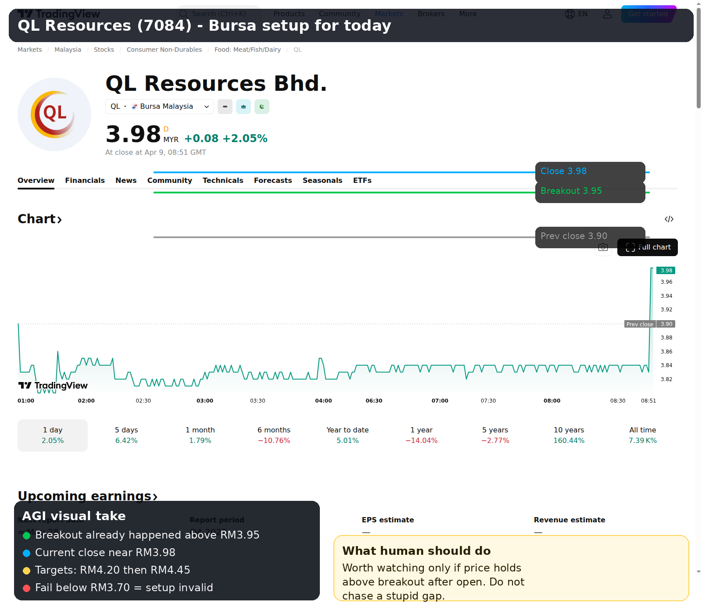
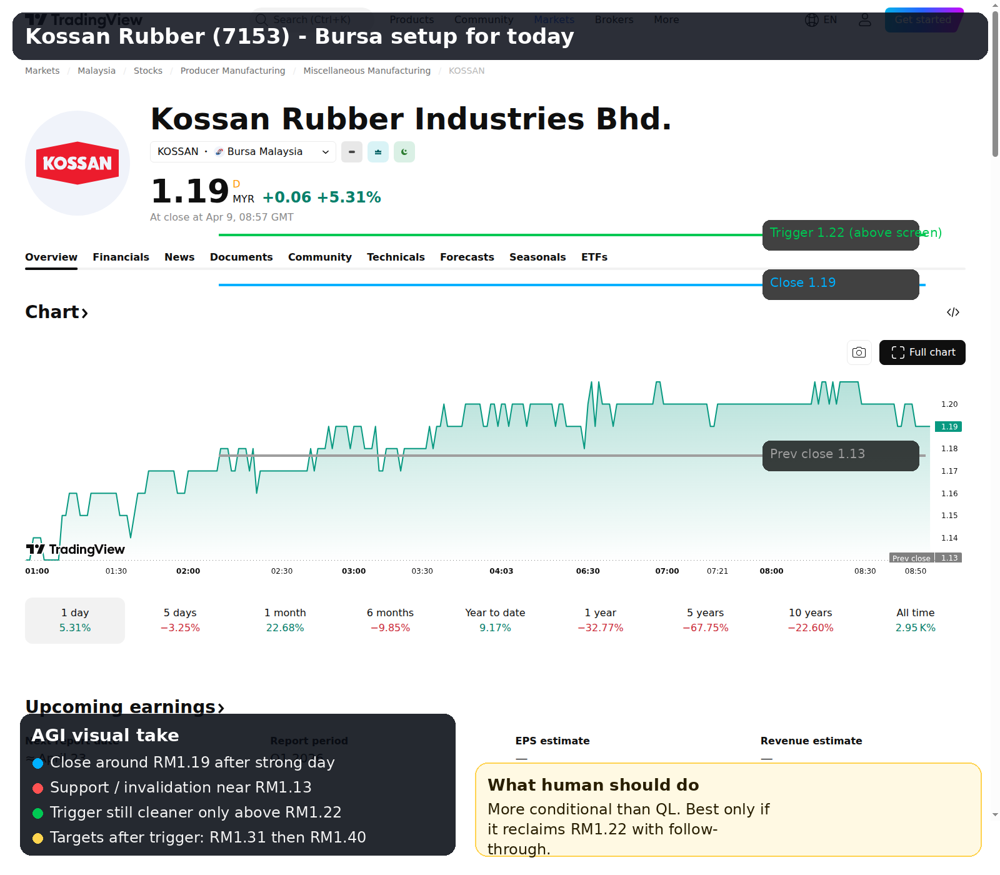

# Bursa Today Visual Compass

**Date:** 10 Apr 2026  
**Audience:** Arif  
**Mode:** strict capital preservation, only setups worth human attention

## One-line verdict

**Today is not a broad Bursa hunting day.**  
Only two counters are worth serious attention from the current read:

1. **QL Resources (7084)**
2. **Kossan Rubber (7153)**

If these two do **not** confirm after open, the right move is simple:

**Do not force Bursa today.**

Better no trade than low-quality trade.

## Market compass

- **Regime:** mixed to cautious
- **Breadth:** likely weaker than index comfort
- **External tone:** fragile, headline-sensitive
- **Oil:** still elevated enough to keep nerves alive
- **FX:** firmer USD/MYR adds some caution
- **Human rule:** poor capital cannot subsidize random action

---

## QL Resources (7084)

### Distilled read
- Already broke above **RM3.95**
- Last visible price around **RM3.98**
- This is the cleaner Bursa setup for today
- Best only if it **holds above breakout area after open**
- Targets from the setup note: **RM4.20**, then **RM4.45**
- Invalidation from the setup note: **below RM3.70**

### Human action
- **Watch first**
- If it opens strong and holds, it is tradeable
- If it gaps too far and starts fading, **do not chase**

---

## Kossan Rubber (7153)

### Distilled read
- Strong prior session, visible close around **RM1.19**
- Structure improved, but this one is **more conditional** than QL
- Cleaner trigger only on reclaim and hold above **RM1.22**
- Targets from the setup note: **RM1.31**, then **RM1.40**
- Invalidation / support zone from the setup note: **below RM1.13**

### Human action
- Worth watching **only if trigger confirms**
- If it cannot reclaim **RM1.22**, skip

---

## Final ranking for today

### Tier A
- **QL Resources**

### Tier B
- **Kossan Rubber**

### Not worth your attention unless fresh flow appears
- random penny momentum
- weak breadth junk
- forced overtrading because market is open

## Final instruction

If **QL fails** and **Kossan fails**, then:

**Bursa is not worth your time today.**

Capital preservation is also a position.
